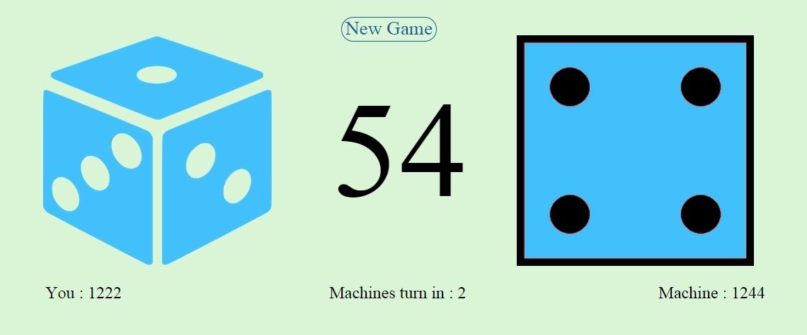

# Oh My Die ! - A simple javascript coded game 

Just like life, skill and luck are required to play this game.Your skill depends on how close you roll the die when the timer approaches 50.Your luck is about getting a value from 1 to 6 from the roll.

#  How to play

Click the die as close to timer value 50. And just be lucky that yu end up with a higher die value (highest-6, lowest-1)
Blue die is User. Red die is machine.

# Score
Score formula=2 x dieface_value x (50-(absolute(timerclick-50)))

# Screenshot

# Contact
For suggestions and feedback : aloygupta1993@gmail.com

